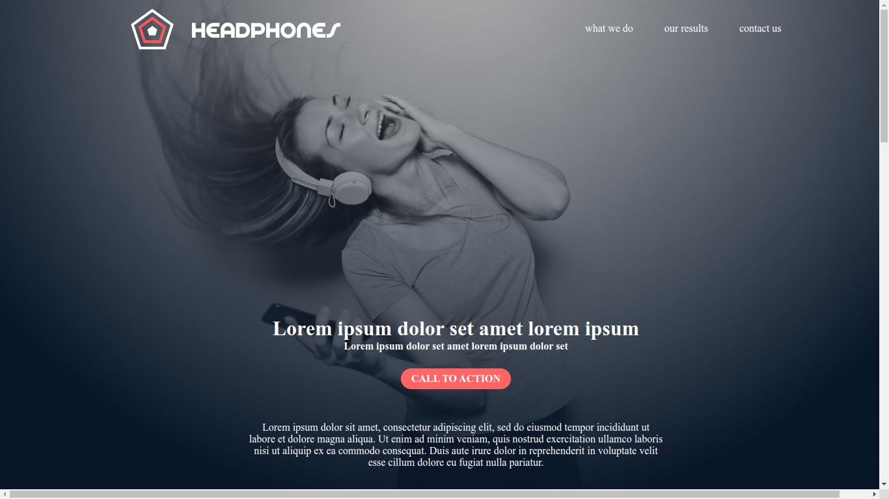
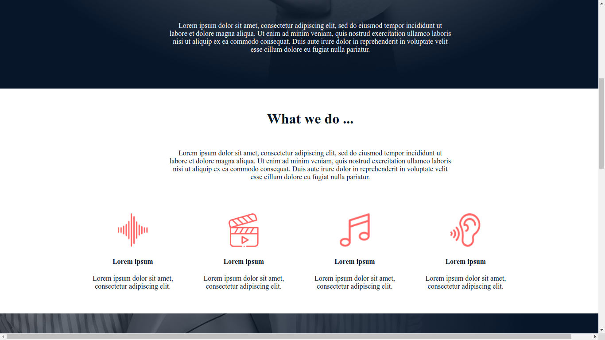
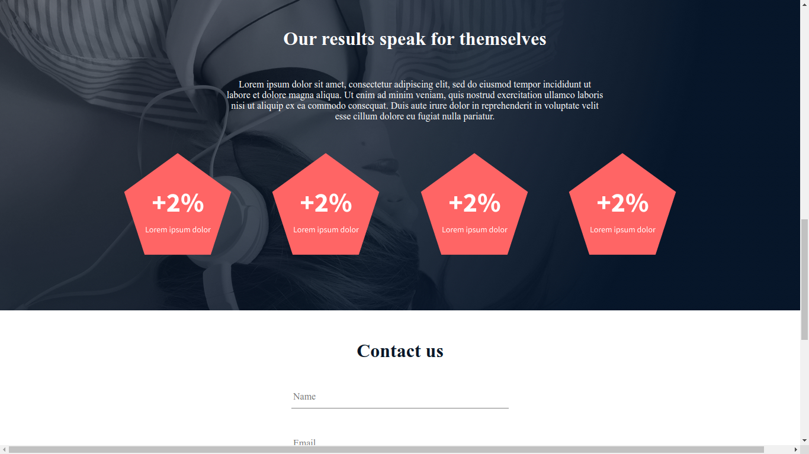
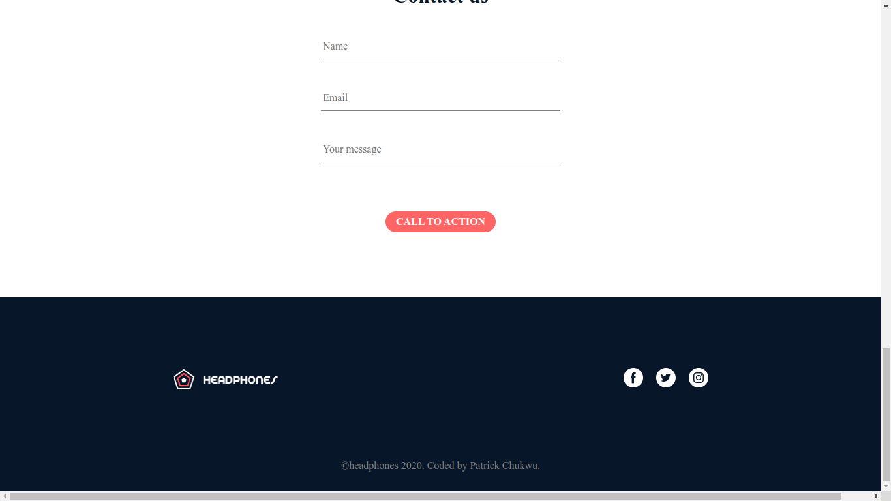

# A website for an imaginary headphone company

This is a solution to a task from [ALX Introduction to Software Engineering](https://www.figma.com/file/glSzGhH0aPzOsN7NcHy09W/Holberton-School---Headphone-company-(Copy)?type=design&node-id=0-362&mode=design&t=irLR0ogec7bRWJSm-0). 

## Table of contents

  - [Overview](#overview)
  - [Screenshot](#screenshot)
  - [Links](#links)
  - [My process](#my-process)
  - [Built with](#built-with)
  - [Author](#author)

## Overview
For this week's project challenge, I  built a website for an imaginary headphone company.

### Screenshots of my results
##### Desktop version

<!-- ##### Mobile version:
 -->

### Links

- Solution URL: [My codes](https://github.com/Patrick-Chukwu/MySuperRepo/tree/main/frontend_mentor_challenges/qr-code_page)
- Live Site URL: [yet to upload it live](https://your-live-site-url.com)

## My process
   - I built the markup first
   - Then I proceeded to style from top-to-bottom with M
   - Since it's just a desktop version alone, I built only for desktop.
   
### Built with

- Semantic HTML5 markup
- CSS custom properties
- Flexbox

## Author

- Website - [Patrick Chukwu](https://www.your-site.com)
- Linkedin - [Patrick Chukwu](https://www.linkedin.com/in/patrick-chukwu)
- Twitter - [@pattyfean](https://www.twitter.com/d_patrickchukwu)

